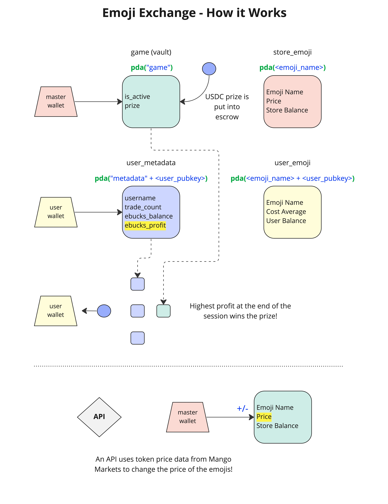

# Emoji Exchange!
This is a swapping game powered by PDAs on Solana!   
### Challenge: 
Can you successfully turn a profit by the end of this workshop?   
The user with the highest profit at the end of the session will win the USDC prize!   
   
Built using `npx create-solana-dapp -f next -p native`.   
   
To learn more about how this dApp works see [How it Works](#how-it-works) below.   
   
**You can find more Solana development resources in the `README.md` at the root of this repository.**

### How to Build & Run

You'll need to deploy this program to the Solana blockchain before you can successfully run the frontend. You can do this in two ways:
1. Run `anchor build && anchor deploy` to build the program and deploy it.
2. Import the program (Rust) code into the [Solana Playground IDE](https://beta.solpg.io) by using the "Import from GitHub" option. You'll want to select `anchor` and then import the GitHub url that routes to the `workshop-dapps/emoji-exchange/programs/emoji-exchange` directory. You should see `src` and `Cargo.toml` if you're in the right place. Then just click "Build" and "Deploy" in the wrench & hammer tab.
   
Next you can choose to run the test or launch the frontend. **Note:** the API must also be launched to initialize the game & then kept running in order to modify prices.   
   
To run the test: `yarn install && anchor run test-emoji-exchange` (in the root directory).   
   
To launch the frontend: `yarn install && yarn dev` (in the `app/` directory).   
   
To launch the API: `yarn install && yarn start` (in the `api/` directory).   
   
**Note:** You may also choose to explore the simplified example program (which attempts to show a simplification of the Emoji Exchange PDA structure), stored in the `voting-program` folder. There is no frontend or API for this program, but you can choose to build & deploy the program in the same fashion as above, and test it using `anchor run test-voting-program`.

### How it Works

